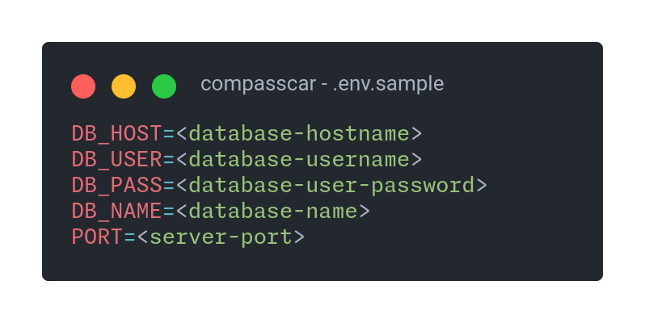
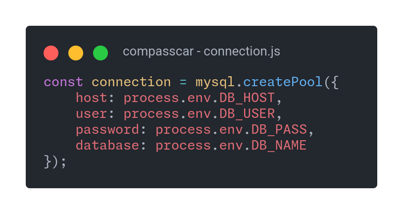
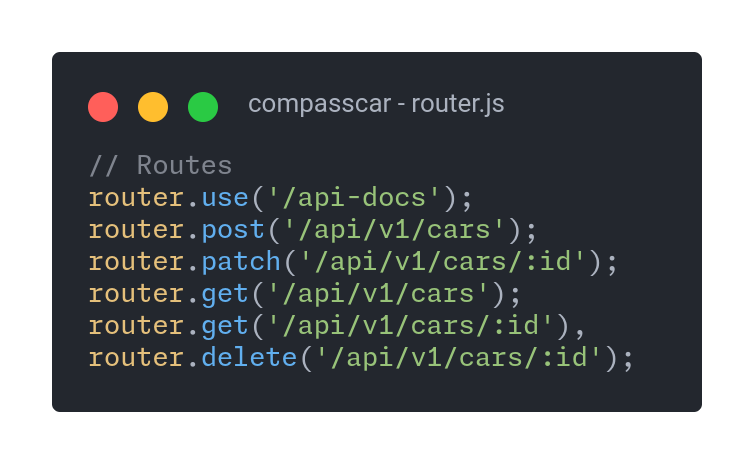

# Compass Car
This is a Node API is a RESTful API built using Node.js, Express, and MySQL. This API provides a backend service for handling user data.
___
## Summary
- [Introduction](#introduction)
- [Project Structure](#project-structure)
- [Top-Level Directories](#top-level-directories)
- [Installation and Usage](#installation-and-usage)
- [API Documentation](#api-documentation)
___
## Introduction
The `Compasscar` is a project designed to manage vehicle registrations in a MySQL database, providing a complete RESTful API to insert, update, remove, and search for vehicles. Compasscar also offers data validation to mitigate errors.
___
## Project Structure
The project folder consists of the following files and directories:

```
/compasscar
│
├──/controllers
│	└── carsController.js
│
├──/database
│	└── connection.js
│
├──/docs
│	├── README.md
│	└──/images
│		├── connection.jpg
│		├──	envsample.jpg
│		├──	index.jpg
│		└── routes.jpg
│
├──/middlewares
│	├─ carsMiddlewares.js
│	└─ existsById.js
│
├──/models
│	└── carsModel.js
│
├──/routes
│	└── router.js
│
├──/src
│   └── index.js
│
│
├── .env
├── .env.sample
├── .gitignore
├── package.json
└── pnpm-lock.yaml
```
___
## Top-Level Directories

- **`/src`**: Contains the source code of the application server.
- **`/database`**: Contains files related to database configuration.
- **`/models`**: Contains model files that define the schema and interact with the database.
- **`/controller`**: Controllers handle the business logic and interact with models and services to process requests and generate responses.
- **`/middlewares`**: Contains middleware functions that handle requests before they reach the controller.
- **`/routes`**: Contains route definition files that map HTTP requests to controller methods.
- **`/docs`**: Contains all documentation files and images to doc.
- **`.env`**: Environment configuration file (not included in version control).
- **`.gitignore`**: Specifies files and directories to be ignored by Git.
- **`README.md`**: Overview and basic instructions for the project.

___
## Installation and Usage
To install and run the `compasscar` project, follow these steps:

#### 1. First it all you need to install and configure MySQL 
If you have docker installed in your machine, you can run this command to use mysql docker image:
```bash
docker run mysql -e MYSQL_ROOT_PASSWORD=root -p 3306:3306 -d mysql
```
Or acess [MySQL Website](https://dev.mysql.com/doc/refman/8.0/en/installing.html).
#### 2. After that run this queries to set up database

To create database:
```sql
CREATE DATABASE compasscar;
USE compasscar;
```
To create tables:
```sql
CREATE TABLE cars(
	id INT AUTO_INCREMENT,
	brand VARCHAR(100),
	model VARCHAR(100),
	year INT,
	PRIMARY KEY (id)
);
```
```sql
CREATE TABLE cars_items(
	id INT AUTO_INCREMENT,
	name VARCHAR(100),
	car_id INT,
	PRIMARY KEY (id),
	FOREIGN KEY (car_id) REFERENCES car.id
);
```
#### 3. Clone the project repository: 
```bash
git clone https://github.com/fsuares/compasscar.git
```
#### 4. Navigate to the project directory: 
```bash
cd compasscar
```

#### 5. Install the required dependencies: 
```bash
pnpm install
```
Or:


```bash
npm install
```
#### 6. So you need to configure your enviroment variables




#### 7. Start the application: 

```bash
pnpm start
```
Or:

```bash
npm run start
```

#### 8. Or run in developer mode:

```bash
pnpm dev
```
Or:

```bash
npm run dev
```
___
## API Documentation

This is all endpoints of API:




You can acess `/api-docs` endpoint to see the entire API documentation or simple click [here](https://fsuares.github.io/compasscar/).

